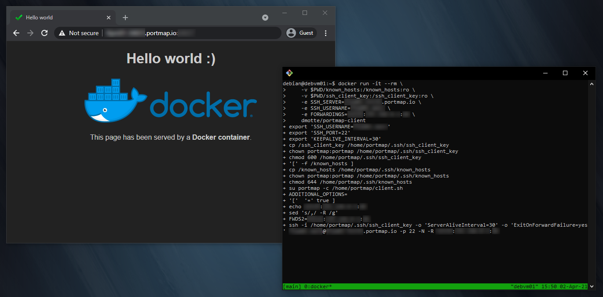

# docker-portmap-client


[](https://github.com/dmotte/docker-portmap-client/actions)
[](https://hub.docker.com/r/dmotte/portmap-client)

This is a :whale: **Docker image** you can use to expose **one or more TCP ports** to the internet using an **SSH tunnel**.

It works by connecting to a (publicly exposed) SSH server; this can be for example an instance of the **[dmotte/portmap-server](https://github.com/dmotte/docker-portmap-server.git) image** or an online **SSH tunneling service** like [portmap.io](https://portmap.io/)

> :package: This image is also on **Docker Hub** as [`dmotte/portmap-client`](https://hub.docker.com/r/dmotte/portmap-client) and runs on **several architectures** (e.g. amd64, arm64, ...). To see the full list of supported platforms, please refer to the `.github/workflows/docker.yml` file. If you need an architecture which is currently unsupported, feel free to open an issue.

## Usage

For this section, we assume that you have already set up an SSH server for remote port forwarding (such as [`dmotte/portmap-server`](https://hub.docker.com/r/dmotte/portmap-server)) or you use an online port forwarding service (such as [portmap.io](https://portmap.io/)).

This Docker image only supports **SSH public key authentication**, so we assume that you have a :key: **private key file** (hereinafter called `ssh_client_key`) to log into the server. Please note that the private key file must be kept **unencrypted**, as otherwise the SSH client would ask for the passphrase at startup.

Then you'll need an SSH `known_hosts` file containing the **public fingerprint** of your server. To obtain it, you can use the following command (replace the server address and port with yours):

```bash
ssh-keyscan -p 2222 10.0.2.15 > "known_hosts"
```

> **Note**: if you want, you can bypass the known_hosts step by setting the `DO_NOT_CHECK_HOST_KEY` environment variable to `true` (see [below](#Environment-variables)), although it is **not advised** for security reasons. Please refer to the [OpenSSH client manual page](https://linux.die.net/man/1/ssh) for further information.

Now suppose that you want to publicly expose (using portmap.io) a web service running locally in your LAN at `http://192.168.0.123:8080/`. You can start your portmap client container like this:

```bash
docker run -it --rm \
    -v $PWD/known_hosts:/known_hosts:ro \
    -v $PWD/ssh_client_key:/ssh_client_key:ro \
    -e SSH_SERVER=myuser-12345.portmap.io \
    -e SSH_USERNAME=myuser.mycfg \
    -e FORWARDINGS=12345:192.168.0.123:8080 \
    dmotte/portmap-client
```

Example:



For a more complex example, refer to the `docker-compose.yml` file.

### Environment variables

List of supported **environment variables**:

Variable                | Required              | Description
----------------------- | --------------------- | ---
`SSH_SERVER`            | **Yes**               | SSH server to use for tunneling
`SSH_PORT`              | No (default: 22)      | TCP port of the SSH server
`SSH_USERNAME`          | No (default: portmap) | SSH username
`FORWARDINGS`           | **Yes**               | Comma-separated (`,`) list of port forwardings, defined as `[bind_address:]port:host:hostport` (see [`man ssh`](https://linux.die.net/man/1/ssh) for more details)
`KEEPALIVE_INTERVAL`    | No (default: 30)      | Value for the `ServerAliveInterval` option of the OpenSSH client
`DO_NOT_CHECK_HOST_KEY` | No (default: false)   | If set to `true`, strict host key checking (OpenSSH `StrictHostKeyChecking` option) will be disabled

### Volumes

List of useful **Docker volumes** that can be mounted inside the container:

Internal path     | Required | Description
----------------- | -------- | ---
`/known_hosts`    | No       | File containing the SSH server's public fingerprint(s)
`/ssh_client_key` | **Yes**  | Unencrypted private key file that will be used by the OpenSSH client to authenticate itself

## Development

If you want to contribute to this project, the first thing you have to do is to **clone this repository** on your local machine:

```bash
git clone https://github.com/dmotte/docker-portmap-client.git
```

Place your `ssh_client_key` and `known_hosts` files into the `vols-portmap-client` directory.

Edit the `docker-compose.yml` file adapting its content to fit your scenario.

Then you just have to run this command:

```bash
docker-compose down && docker-compose up --build
```

This will automatically **build the Docker image** using the `docker-build` directory as build context and then the **Docker-Compose stack** will be started.

If you prefer to run the stack in daemon (detached) mode:

```bash
docker-compose up -d
```

In this case, you can view the logs using the `docker-compose logs` command:

```bash
docker-compose logs -ft
```
